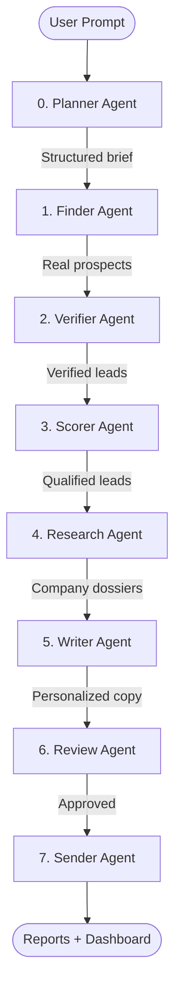

# Research Outreach Agent v3.0

**Describe your ideal client in plain English — a team of AI agents plans the search, discovers _real_ people and companies, verifies them, and writes personalized outreach for each one.**

A prompt-driven, multi-agent system built on **LangGraph**, served by a **FastAPI** backend with real-time SSE log streaming, and a polished **vanilla JS** dashboard. Every lead is put through a verification stage (live company website, deliverable email, valid LinkedIn) and labeled **verified / partial / unverified** with a confidence score — no fabricated contacts.

---

## Highlights

- **Prompt-driven**: one natural-language box (e.g. _"Find SaaS founders in the UK who need AI customer support"_) drives the whole pipeline.
- **Real leads, not hallucinations**: discovery pulls actual LinkedIn profiles and company sites from live web search (Tavily) and optionally the Apify LinkedIn actor. The LLM only *structures* real results — it is explicitly forbidden from inventing people.
- **Verification stage**: each lead's company domain is checked over HTTP, its email is validated (syntax + DNS MX record), and its LinkedIn URL is format-verified. Unverifiable, fabricated leads are dropped (or downranked).
- **Dynamic offering**: defaults to the developer's AI/ML services, but the prompt can describe any product/service to pitch.
- **Deploy-ready**: `Dockerfile`, `docker-compose.yml`, and a Render blueprint (`render.yaml`).

---

## Architecture



| Agent | Role |
|-------|------|
| **Planner** | Turns the free-text prompt into a structured brief (roles, industries, locations, keywords, offering, concrete search queries). |
| **Finder** | Discovers **real** prospects via Tavily web search + Apify LinkedIn; extracts only people/companies that actually appear in results. |
| **Verifier** | Checks company domain (HTTP), email (syntax + MX), and LinkedIn URL; assigns a status + confidence. Optional Apollo.io email enrichment. |
| **Scorer** | Scores each lead 0-100 for fit against the brief; filters below threshold. |
| **Research** | Parallel web research: company summary, recent news, tech stack, pain points, opportunities. |
| **Writer** | Writes channel-specific, de-AI-ified outreach and self-scores tone + personalization. |
| **Review** | Human-in-the-loop CLI approval (auto-approves in web mode). |
| **Sender** | Generates copy by default; can send email via Gmail SMTP behind an explicit opt-in. |

---

## Setup

### 1. Prerequisites
Python 3.12+.

### 2. Install
```bash
python -m venv .venv
# Windows PowerShell
.\.venv\Scripts\Activate.ps1
# macOS/Linux
source .venv/bin/activate

pip install -r requirements.txt
```

### 3. Configure
```bash
cp .env.example .env
```
Fill in your keys:

| Key | Required | Purpose |
|-----|----------|---------|
| `GROQ_API_KEY` | ✅ | LLM (LLaMA-3 via Groq) |
| `TAVILY_API_KEY` | ✅ | Real web/LinkedIn search |
| `APIFY_API_KEY` | optional | LinkedIn people scraping |
| `APOLLO_API_KEY` | optional | Verified work emails |
| `GMAIL_USER` / `GMAIL_APP_PASSWORD` | optional | Real email sending (off by default) |

Useful toggles: `STRICT_VERIFICATION` (drop unverified leads), `ENABLE_EMAIL_SENDING` (allow real sends), `MAX_LEADS_PER_RUN`, `LEAD_SCORE_THRESHOLD`.

---

## Running

### Web dashboard (recommended)
```bash
python run.py
```
Open **http://localhost:8080**, type who you want to reach, set the lead count, and launch. Watch the agents work in the Live Feed, then browse verified leads and generated messages, and export to CSV.

> The port is configurable with the `PORT` env var (defaults to `8080`).

### CLI
```bash
# Interactive — it will ask for your prompt
python main.py

# One-liner
python main.py -p "E-commerce founders doing $1M+ who need inventory automation" --leads 10

# Load your own leads and skip discovery
python main.py --from-csv data/leads/sample_leads.csv
```

---

## Deployment

### Docker
```bash
docker compose up --build
# → http://localhost:8080
```

### Render (one click)
Push to GitHub, then create a new Blueprint from `render.yaml` and paste your API keys as environment variables. Health check is at `/api/health`.

---

## How "verified" works (and its limits)

Verification proves a lead is real using checks you can trust:

- **Company website** — DNS resolves **and** the site returns a live HTTP response.
- **Email** — valid syntax **and** the domain has MX (mail) records. When no email is found but the domain is live, a common corporate pattern is proposed and clearly labeled `pattern-guess` (never presented as confirmed). With `APOLLO_API_KEY`, verified work emails are fetched instead.
- **LinkedIn** — a well-formed public `linkedin.com/in/...` profile URL.

Each lead gets `verified` (high confidence), `partial`, or `unverified`. Fully guaranteeing a working personal inbox requires a paid email-verification provider (Apollo/Hunter) — wire in `APOLLO_API_KEY` for the strongest results.

---

## Outputs

Saved to `data/output/<run_id>/`:
- `leads_report.csv` — leads with scores + verification status
- `messages_report.csv` — generated outreach copy
- `full_run_<run_id>.json` — complete state snapshot

---

## Tech Stack

LangGraph · LangChain · Groq (LLaMA-3) · Tavily · Apify · Apollo.io · FastAPI · Uvicorn · SSE · dnspython · httpx · Vanilla HTML/CSS/JS · Docker
