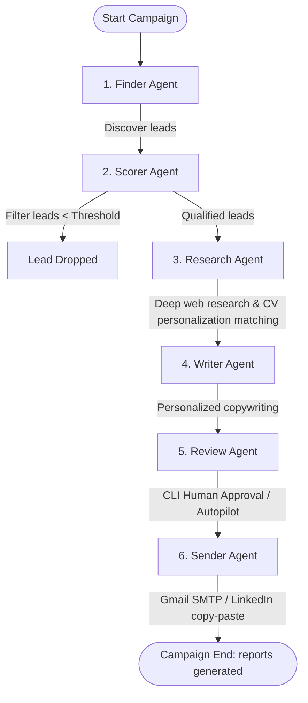

# 🤖 Autonomous Outreach Agent v2.0
An enterprise-grade, multi-agent system designed to identify target B2B prospects, perform deep research on their company’s tech stack, pain points, and current news, and write highly personalized outreach messages (emails, LinkedIn messages, and Reddit posts) using **Muhammad Shaheer Zaman Shah's** developer CV.

This project features a fully autonomous multi-agent backend orchestrated via **LangGraph**, a **FastAPI** server supporting real-time Server-Sent Events (SSE) log streaming, and a high-fidelity **vanilla CSS/JS** single-page application (SPA) dashboard.

---

## 📐 System Architecture & Workflow

The system uses a sequential **LangGraph StateGraph** pipeline. The execution flows from lead discovery to final outreach dispatch:



---

## 📂 Project Structure

```
outreach_agent/
├── main.py                 # CLI campaign execution entrypoint
├── server.py               # FastAPI backend server with SSE streaming
├── run.py                  # Server manager: starts FastAPI and launches browser
├── pipeline.py             # LangGraph state graph orchestration definition
├── requirements.txt        # Core package requirements
├── .env                    # Active local environment variables
├── .env.example            # Environment configuration template
├── Shaheer_Zaman_CV_Full.pdf # Source CV document
│
├── agents/                 # Autonomous Agent implementations
│   ├── finder_agent.py     # Agent 1: lead discovery (LinkedIn, Tavily, LLM)
│   ├── scorer_agent.py     # Agent 2: lead scoring & qualification (0-100)
│   ├── research_agent.py   # Agent 3: company enrichment & pain point analysis
│   ├── writer_agent.py     # Agent 4: customized copywriter (email, LinkedIn, Reddit)
│   ├── review_agent.py     # Agent 5: interactive CLI human review
│   └── sender_agent.py     # Agent 6: automated dispatch & delivery
│
├── config/
│   └── settings.py         # Pydantic Settings management & custom projects config
│
├── state/
│   └── schema.py           # LangGraph StateGraph schemas (OutreachState, Lead, Message)
│
├── prompts/
│   └── templates.py        # Centralized LLM system and user prompt templates
│
├── tools/                  # Utility integrations for agents
│   ├── search.py           # Tavily web search integration
│   ├── scraper.py          # Apify LinkedIn and Apollo.io lead enrichment
│   └── email_sender.py     # Gmail SMTP helper class
│
├── utils/
│   ├── helpers.py          # Log helpers, ID generators, text cleaners
│   ├── llm.py              # Groq chat model factory (LLaMA-3)
│   ├── cv_parser.py        # PDF parser and CV structure parser
│   └── reporter.py         # Output report generators (CSV, JSON)
│
├── data/
│   ├── leads/              # Input data directories
│   │   └── sample_leads.csv
│   └── output/             # Runs archives directory
│       └── <run_id>/       # Specific campaign run files (leads, messages, state)
│
└── frontend/               # Single Page Application frontend
    ├── index.html          # HTML5 layout structure
    ├── styles.css          # Dark-mode dashboard style sheet
    └── app.js              # SSE client-side streaming & UI state controller
```

---

## 🤖 Detailed Agent Explanations

### 1. Finder Agent (`agents/finder_agent.py`)
- **Responsibility**: Lead generation.
- **Workflow**:
  1. If `APIFY_API_KEY` is provided, it fires up a LinkedIn Scraper task to collect fresh target leads based on specified industries and roles.
  2. If more leads are needed, it performs Google/LinkedIn search queries via **Tavily** to find actual active LinkedIn profiles of decision-makers.
  3. Fills any remaining lead quota using Groq (LLaMA-3) by generating realistic lead profiles that perfectly match the target profile.
- **Output**: Populates `raw_leads` in the state.

### 2. Scorer Agent (`agents/scorer_agent.py`)
- **Responsibility**: Lead qualification to prevent spamming and optimize resource usage.
- **Workflow**:
  - Scores leads out of 100 using a combination of **Rule-based heuristic checks** (40%) and **LLM reasoning** (60%).
  - Evaluates: job authority/title, industry relevance, company size, and contact detail availability.
  - Leads scoring below the threshold (default: 65) are skipped, and those meeting it are pushed to the next phase.
- **Output**: Populates `filtered_leads` in the state.

### 3. Research Agent (`agents/research_agent.py`)
- **Responsibility**: Deep-dive intelligence gathering on qualified leads.
- **Workflow**:
  - Performs **parallel Tavily web searches** (up to 3 concurrent requests per lead) to identify:
    - Target company overview & core offerings.
    - Recent business news & press releases.
    - Likely technology stack & pain points.
  - Cross-references the company's pain points with **Muhammad Shaheer Zaman Shah's** developer portfolio projects (e.g., custom RAG models, autonomous agents, computer vision systems) to find the absolute best service/product fit.
- **Output**: Populates `researched_leads` with detailed company dossiers.

### 4. Writer Agent (`agents/writer_agent.py`)
- **Responsibility**: Copywriting and tailoring the outreach.
- **Workflow**:
  - Automatically decides on the optimal communication channel (Email, LinkedIn, or Reddit) based on lead data.
  - Crafts a hyper-personalized message detailing how Shaheer can solve their specific pain points using a concrete portfolio project as proof.
  - Runs a **post-generation filter** to prune AI-isms ("I hope this email finds you well", "leverage", "delve", "testament").
  - Scores the message's natural flow ("human-ness") and personalization level.
- **Output**: Adds customized messages to the pipeline state.

### 5. Review Agent (`agents/review_agent.py`)
- **Responsibility**: Human-in-the-loop review.
- **Workflow**:
  - If `HUMAN_IN_LOOP` is set to `true`, the pipeline pauses to allow the user to view, edit, approve, or reject each generated outreach message directly from the command line.
  - If autopilot is active, it automatically approves high-scoring messages.

### 6. Sender Agent (`agents/sender_agent.py`)
- **Responsibility**: Dispatching the outreach.
- **Workflow**:
  - Sends emails using Gmail SMTP (requires `GMAIL_USER` and `GMAIL_APP_PASSWORD`).
  - For LinkedIn and Reddit, it formats messages ready for copy-pasting to avoid API violations.

---

## ⚡ Setup & Installation

### 1. Prerequisites
Make sure you have Python 3.12+ (CPython recommended) installed on your system.

### 2. Installation
```bash
git clone https://github.com/ShaheerZamanShah/leadGenerationAgent.git
cd leadGenerationAgent

# Create virtual environment
python -m venv .venv

# Activate virtual environment
# Windows (cmd):
.venv\Scripts\activate.bat
# Windows (PowerShell):
.\.venv\Scripts\Activate.ps1
# Mac/Linux:
source .venv/bin/activate

# Install dependencies
pip install -r requirements.txt fastapi uvicorn
```

### 3. Environment Configuration
Create a `.env` file from the template:
```bash
cp .env.example .env
```
Open `.env` and fill in your keys:
- **Groq API Key**: `GROQ_API_KEY` (Required for LLaMA model orchestration)
- **Tavily API Key**: `TAVILY_API_KEY` (Required for deep web research)
- **Apify API Key**: `APIFY_API_KEY` (Optional; for LinkedIn scraper)
- **Gmail SMTP Credentials**: `GMAIL_USER` & `GMAIL_APP_PASSWORD` (Optional; for actual email dispatch)

---

## 🚀 Running the Application

### Option A: Web App Dashboard (Recommended)
This runs the full-stack system with a beautiful, responsive, real-time dashboard.

1. Start the server manager:
   ```bash
   python run.py
   ```
2. Open your browser and navigate to **`http://localhost:8000`**.
3. Use the slider to set your target lead count, choose target communication channels, and click **Start AI Research Campaign**.
4. Watch the progress bar advance and check the **Live Feed** tab to watch agent logs stream in real-time.
5. Review the qualified leads and generated outreach messages in their respective tabs. You can export results to a CSV file with a single click.

### Option B: CLI Mode
This runs the pipeline in the terminal.

- Run a full automated campaign:
  ```bash
  python main.py
  ```
- Run a campaign using a custom CSV leads list:
  ```bash
  python main.py --from-csv data/leads/sample_leads.csv
  ```
- Run a dry-run campaign (does not send emails):
  ```bash
  python main.py --dry-run
  ```
- Run a campaign for a limited number of leads:
  ```bash
  python main.py --leads 5
  ```

---

## 💾 Outputs & Reports
After every campaign run, detailed outputs are saved locally to `data/output/<run_id>/`:
1. `leads_report.csv`: Complete database of all discovered prospects, including their scores, metadata, pain points, and recommended services.
2. `messages_report.csv`: All approved outreach copies, subjects, and channels.
3. `full_run_<run_id>.json`: A complete state snapshot of the entire LangGraph run, useful for debugging or loading past runs.

---

## 🛠 Tech Stack
- **Agent Framework**: LangGraph, LangChain Core
- **LLM Engine**: Groq (LLaMA-3.1-8B-Instant & LLaMA-3.3-70B-Versatile)
- **Search & Scraping**: Tavily API, Apify (LinkedIn Profile Scraper)
- **Backend API**: FastAPI, Uvicorn, SSE Starlette Event Stream
- **Frontend Dashboard**: Vanilla HTML5, CSS3, JavaScript (SSE client, CSS Grid, Glassmorphism, animations)
