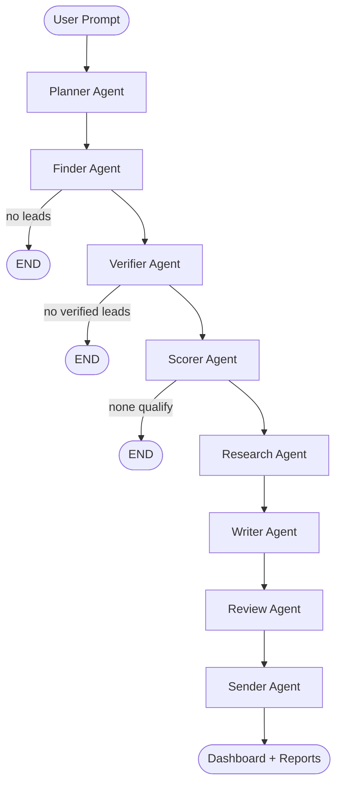

# Lead Generation Agent (Research Outreach Agent v3.0)

**Describe your ideal client in plain English — a team of AI agents plans the search, discovers real people and companies, verifies them, researches each one, and writes personalized outreach messages.**

Built by **Muhammad Shaheer Zaman Shah** — AI/ML & Agentic AI Developer.

A prompt-driven, multi-agent pipeline powered by **LangGraph**, served through a **FastAPI** backend with real-time **SSE** log streaming, and a polished **vanilla JS** dashboard. The system is designed to find **real** prospects (not hallucinated contacts), verify them with concrete checks, and complete campaigns reliably even when API rate limits are hit.

**Live repo:** https://github.com/ShaheerZamanShah/leadGenerationAgent

---

## What it does

1. You type who you want to reach (e.g. *"Find SaaS founders in Europe who need AI customer support"*).
2. **Planner** turns that into a structured campaign brief (roles, industries, locations, search queries).
3. **Finder** discovers real prospects via Tavily web search and optionally Apify LinkedIn scraping.
4. **Verifier** checks company websites, emails, and LinkedIn URLs — labels each lead **verified / partial / unverified**.
5. **Scorer** rates fit 0–100 and filters below threshold.
6. **Research** enriches each lead with company intel, pain points, and opportunities.
7. **Writer** generates channel-specific outreach (email, LinkedIn, Reddit).
8. **Review** auto-approves in web mode (or interactive CLI review).
9. **Sender** prepares messages for copy/send (dry-run by default).

Results appear live in the dashboard and are saved to `data/output/<run_id>/`.

---

## Highlights

| Feature | Description |
|---------|-------------|
| **Prompt-driven** | One natural-language input drives the entire pipeline |
| **Real leads only** | LLM structures search results — it does not invent people |
| **Verification stage** | HTTP domain check, email syntax + MX, LinkedIn URL validation |
| **Rate-limit resilient** | Falls back to fast LLM, heuristics, and templates when Groq limits hit |
| **Campaign re-runs** | Starting a new campaign cancels the previous one cleanly |
| **Live dashboard** | SSE progress feed, lead cards, message viewer, CSV export |
| **Deploy-ready** | Docker + Render blueprint — no Docker needed on your PC |

---

## Architecture

### Pipeline flow (normal campaign)



### Pipeline flow (`--from-csv`)

When leads are pre-loaded from a CSV file, discovery is skipped:

```
START → Planner → Verifier → Scorer → Research → Writer → Review → Sender → END
```

The scorer **only** processes `verified_leads`. If the verifier drops all leads (e.g. `STRICT_VERIFICATION=true`), the pipeline ends gracefully — it never re-scores rejected raw leads.

### Agents

| # | Agent | Role |
|---|-------|------|
| 0 | **Planner** | Parses the user prompt into a `SearchBrief` (roles, industries, locations, offering, search queries) |
| 1 | **Finder** | Discovers real prospects via Apify LinkedIn + Tavily web search; heuristic fallback when LLM is rate-limited |
| 2 | **Verifier** | Validates domains, emails, LinkedIn; optional Apollo enrichment; strict mode drops unverified leads |
| 3 | **Scorer** | Scores verified leads 0–100; respects verifier filtering (no raw_leads fallback) |
| 4 | **Research** | Sequential per-lead research: company summary, news, tech stack, pain points |
| 5 | **Writer** | Channel-specific outreach with quality scoring; template fallback on rate limits |
| 6 | **Review** | Human-in-loop in CLI; auto-approves all messages in web mode |
| 7 | **Sender** | Dry-run by default; can send via Gmail SMTP when explicitly enabled |

---

## Project structure

```
outreach_agent/
├── agents/              # LangGraph agent nodes (planner → sender)
├── config/settings.py   # Centralised .env configuration
├── frontend/            # Dashboard (HTML, CSS, JS)
├── prompts/templates.py # LLM prompt templates
├── state/schema.py      # Typed pipeline state (OutreachState)
├── tools/               # Tavily search, Apify scraper, verification, email
├── utils/               # LLM factory, helpers, reporter, CV parser
├── data/output/         # Campaign results (gitignored)
├── pipeline.py          # LangGraph graph wiring
├── server.py            # FastAPI backend + SSE streaming
├── main.py              # CLI entrypoint
├── run.py               # Starts server + opens browser
├── Dockerfile           # Production container image
├── docker-compose.yml   # Local Docker setup (optional)
└── render.yaml          # Render.com deploy blueprint
```

---

## Setup (local)

### Prerequisites

- **Python 3.12+**
- API keys (see below)
- **Docker is NOT required** for local development

### 1. Clone & install

```bash
git clone https://github.com/ShaheerZamanShah/leadGenerationAgent.git
cd leadGenerationAgent

python -m venv .venv

# Windows PowerShell
.\.venv\Scripts\Activate.ps1
# macOS/Linux
source .venv/bin/activate

pip install -r requirements.txt
```

### 2. Configure environment

```bash
cp .env.example .env
```

| Variable | Required | Purpose |
|----------|----------|---------|
| `GROQ_API_KEY` | ✅ | LLM via Groq (LLaMA-3) |
| `TAVILY_API_KEY` | ✅ | Web search for lead discovery & research |
| `APIFY_API_KEY` | optional | LinkedIn profile scraping (free tier: ~10 runs) |
| `APIFY_LINKEDIN_ACTOR` | optional | Apify actor ID (default: `harvestapi/linkedin-profile-search`) |
| `APOLLO_API_KEY` | optional | Verified work email enrichment |
| `GMAIL_USER` / `GMAIL_APP_PASSWORD` | optional | Real email sending (off by default) |

**Useful toggles:**

| Variable | Default | Effect |
|----------|---------|--------|
| `LEAD_SCORE_THRESHOLD` | `60` | Minimum score to qualify a lead |
| `MAX_LEADS_PER_RUN` | `15` | Cap leads per campaign |
| `STRICT_VERIFICATION` | `false` | Drop all unverified leads |
| `HUMAN_IN_LOOP` | `false` | Interactive CLI review before sending |
| `ENABLE_EMAIL_SENDING` | `false` | Allow real Gmail sends |
| `PORT` | `8080` | Server port (local) |

---

## Running locally

### Web dashboard (recommended)

```bash
python run.py
```

Open **http://localhost:8080**, enter your prompt, set lead count, and click **Launch Research Campaign**. Watch progress in the Live Feed tab, then browse leads and messages. Export results as CSV.

### CLI

```bash
# Interactive — prompts for your campaign description
python main.py

# One-liner
python main.py -p "E-commerce founders doing $1M+ who need inventory automation" --leads 10

# Auto-approve, no email sending
python main.py -p "SaaS founders in Europe" --no-review --leads 5

# Load your own leads (skips Finder, runs verify → score → research → write)
python main.py --from-csv data/leads/sample_leads.csv
```

### API (for integrations)

| Method | Endpoint | Description |
|--------|----------|-------------|
| `GET` | `/api/health` | Health check |
| `POST` | `/api/start-campaign` | Start a campaign (`prompt`, `max_leads`) |
| `GET` | `/api/stream/{run_id}` | SSE live log + results stream |
| `GET` | `/api/status/{run_id}` | Campaign status |
| `GET` | `/api/results/{run_id}` | Full JSON results |
| `POST` | `/api/cancel-campaign/{run_id}` | Cancel a running campaign |
| `GET` | `/api/cv-info` | Developer CV summary |

Interactive API docs: **http://localhost:8080/docs**

---

## Deployment (Render)

You do **not** need Docker installed on your computer. Render builds and runs the `Dockerfile` in the cloud.

### First-time setup

1. Push code to GitHub: https://github.com/ShaheerZamanShah/leadGenerationAgent
2. Go to [render.com](https://render.com) → **New** → **Blueprint**
3. Connect your GitHub repo — Render reads `render.yaml` automatically
4. Set secret environment variables in the Render dashboard:
   - `GROQ_API_KEY`
   - `TAVILY_API_KEY`
   - `APIFY_API_KEY` (optional)
   - `APOLLO_API_KEY` (optional)
5. Deploy — your app will be live at a `*.onrender.com` URL

### Auto-deploy on git push

**Yes — if Render is connected to your GitHub repo, changes are deployed automatically.**

`render.yaml` sets `autoDeploy: true`, which means:

1. You push a commit to the connected branch (usually `main`)
2. Render detects the push via GitHub webhook
3. Render rebuilds the Docker image and redeploys
4. Your live site updates (typically takes 3–8 minutes)

**What updates automatically:** application code, frontend, agents, pipeline logic.

**What does NOT update automatically:** environment variables in the Render dashboard (API keys, toggles). Change those manually in Render → your service → **Environment**.

**To verify a deploy:** check the Render dashboard **Events** tab, or hit `/api/health` on your live URL and confirm the version responds.

### Optional: Docker locally

Only needed if you want to test the production container on your machine:

```bash
docker compose up --build
# → http://localhost:8080
```

---

## Verification (how leads are checked)

Each lead receives a `verification` block:

| Check | Method |
|-------|--------|
| **Company website** | DNS resolves + HTTP response |
| **Email** | Syntax valid + domain has MX records |
| **LinkedIn** | Well-formed `linkedin.com/in/...` URL |
| **Apollo enrichment** | Fetches verified work email when `APOLLO_API_KEY` is set |
| **Pattern-guess email** | Proposed from live domain when no email found (labeled `pattern-guess`, never shown as verified) |

**Status labels:** `verified` · `partial` · `unverified`

With `STRICT_VERIFICATION=true`, unverified leads are dropped and the pipeline ends if none remain.

---

## Rate limits & reliability

The system is built to **complete campaigns** even under API pressure:

- **Groq (LLM):** Prefers fast model; retries short waits; falls back to heuristics/templates on daily limits
- **Apify:** Disables itself for the session when free-tier run limit is hit; continues via Tavily
- **Research:** Runs sequentially (not parallel) to avoid TPM stampedes
- **Campaign re-runs:** New campaign cancels the previous one; SSE reconnects automatically

---

## Outputs

Each run saves to `data/output/<run_id>/`:

| File | Contents |
|------|----------|
| `leads_report.csv` | Qualified leads with scores and verification status |
| `messages_report.csv` | Generated outreach copy per lead |
| `full_run_<run_id>.json` | Complete pipeline state snapshot |

The web dashboard also supports one-click CSV export.

---

## Tech stack

| Layer | Technology |
|-------|------------|
| Orchestration | LangGraph, LangChain |
| LLM | Groq (LLaMA-3.1 8B + LLaMA-3.3 70B) |
| Search | Tavily |
| LinkedIn | Apify (`harvestapi/linkedin-profile-search`) |
| Email enrichment | Apollo.io |
| Email sending | Gmail SMTP (optional) |
| Backend | FastAPI, Uvicorn, SSE |
| Frontend | Vanilla HTML / CSS / JS |
| Verification | dnspython, httpx |
| Deployment | Docker, Render.com |

---

## License & author

Built by **Muhammad Shaheer Zaman Shah** — AI/ML & Agentic AI Developer.

Portfolio: https://shaheer-portfolio.dev · LinkedIn: https://linkedin.com/in/shaheer-zaman
